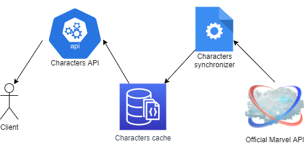

# Xendit Marvel API Coding Challenge

## Setting-up and running the application

### 1. Install system dependencies:

* Docker > 19.x
* Docker Compose > 1.24.x

### 2. Copy .env.sample to .env. In .env, the important environment variable values to replace are:

* MARVEL_API_PRIVATE_KEY
* MARVEL_API_PUBLIC_KEY

The other variables can be left unchanged.

### 3. Build and run the application by executing:

```
docker-compose up --build
```

## Swagger UI
The Swagger UI is available at [http://localhost:8080/](http://localhost:8080/)

## Architecture
